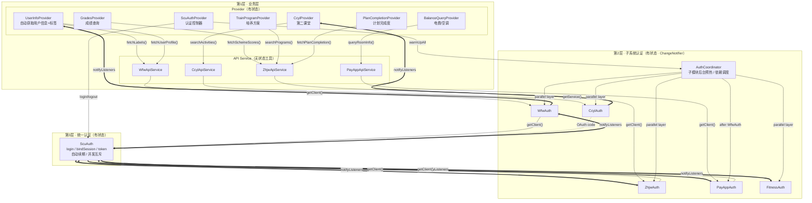
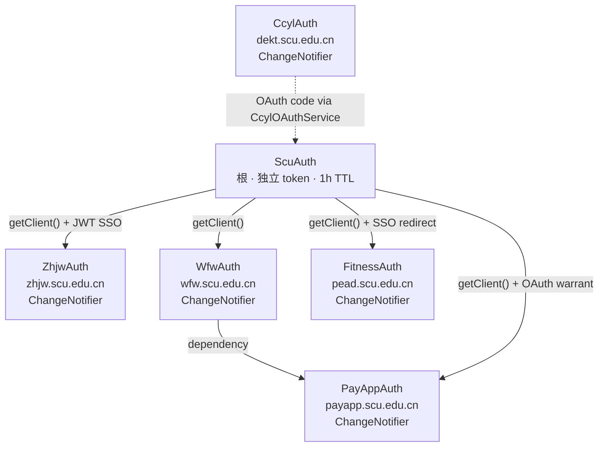
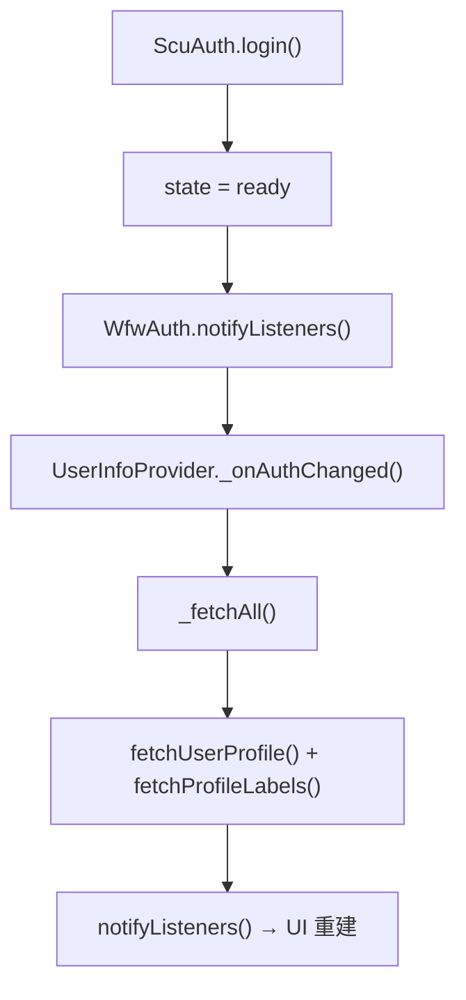
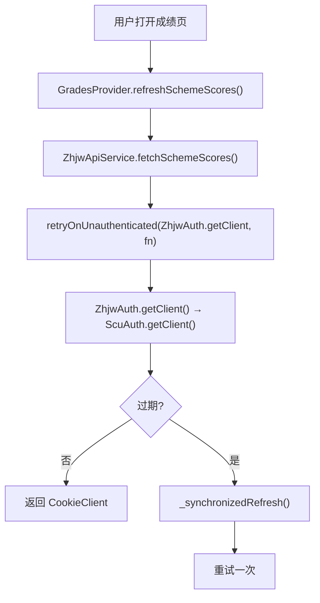
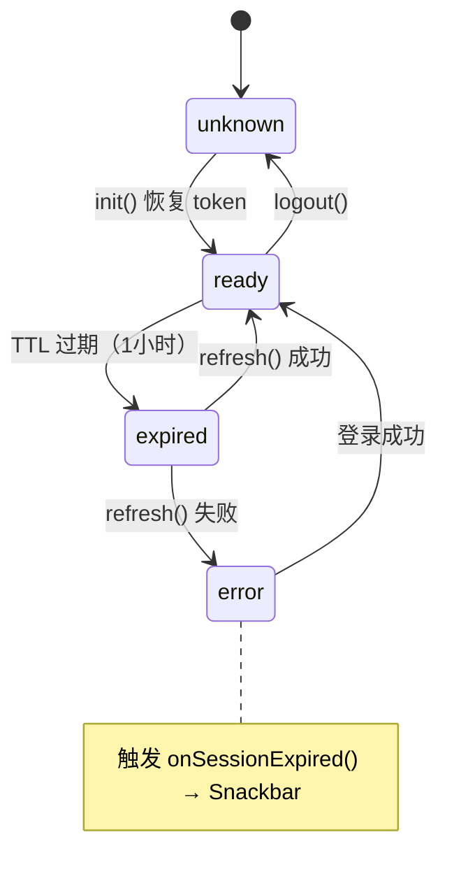
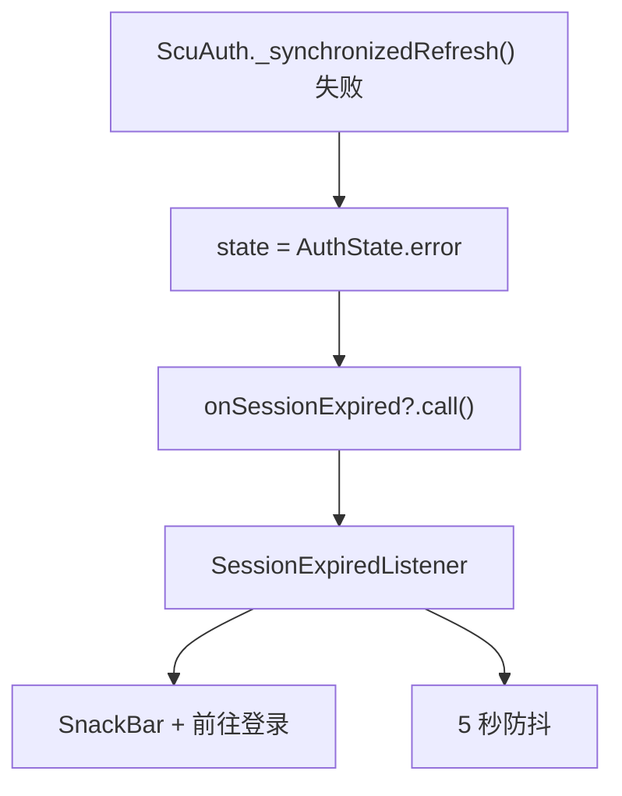
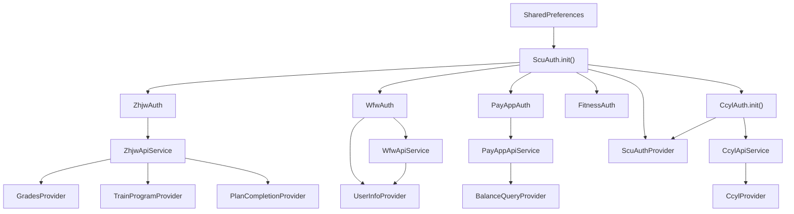

# 认证架构设计决策

## 概述

三层架构 + 子模块认证 + 响应式通知链，统一管理 SCU 统一认证、教务系统、微服务、缴费平台、体测、第二课堂六个后端服务的认证与数据访问。

核心原则：
1. **三层分离**：业务层 (L1) → 子系统 Auth (L2) → ScuAuth (L3)
2. **L1 内部分工**：Provider（有状态，管理 UI）+ API Service（无状态，HTTP 工具）
3. **子模块认证契约**：每个子系统通过 `SubsystemAuth` 声明自己的鉴权方式和依赖关系
4. **显式依赖 & 并行预热**：`AuthCoordinator` 按依赖分层，无依赖模块并行，有依赖串行
5. **L2 自管就绪**：`WfwAuth` 等模块持有自己的 `_ready`，仅 session 绑定后才通知 Provider 发起请求
6. **异常冒泡 + 自动重试**：`UnauthException` 穿透 → `invalidate()` → 重新鉴权 → 重试一次
7. **并发安全**：`_synchronizedRefresh` 确保 N 并发 = 1 次刷新

## 三层架构 + 响应式链



### 三层职责

| 层 | 组件 | 有状态? | 职责 |
|---|---|---|---|
| **L1 业务层** | Provider | ✅ 有状态 | UI 状态管理（loading/error/data），监听 L2 自动获取数据 |
| | API Service | ❌ 无状态 | HTTP 请求 + 解析 + 过期检测 + 重试，纯工具 |
| **L2 子系统认证** | ZhjwAuth / WfwAuth / ... | ✅ 有状态 | 子系统认证 + 监听 L3 转发通知给 L1 |
| **L3 统一认证** | ScuAuth | ✅ 有状态 | 登录 / token / SSO / 自动续期 / 并发互斥 |

## AuthCoordinator：子系统预热与依赖调度

`AuthCoordinator` 在统一认证成功后后台预热所有子模块。每个模块通过 `SubsystemAuth.dependencies` 声明前置依赖：

```text
zhjw    → 无依赖
wfw     → 无依赖
fitness → 无依赖
ccyl    → 无依赖
payapp  → 依赖 wfw
```

- 第一层（无依赖）：`zhjw + wfw + fitness + ccyl` 并行执行
- 第二层：`payapp` 只等 `wfw` 完成，不等 `zhjw`/`fitness`/`ccyl`
- 依赖失败只跳过下游，其他模块不受影响

预热也由 [home_page.dart](E:/repo/Bugaoshan/lib/pages/home_page.dart:55) 在 app 启动、token 有效时直接触发，确保子系统 session 在 Provider 首次请求前已就绪。

## WfwAuth 自管就绪

`WfwAuth.isReady` 不再代理 `ScuAuth.isReady`，而是由内部 `_ready` 标志控制：

- 初始 `false`
- `ensureAuthenticated()` 或 `getClient()` 成功后置 `true` 并 `notifyListeners()`
- `ScuAuth` 登出时重置为 `false`
- `invalidate()` 也重置，配合重试清除过期状态

这样 `UserInfoProvider` 构造时不会立即发起请求；只有 session 绑定完成后才收到通知并开始获取数据。

### 响应式通知链

```text
ScuAuth token 恢复 → HomePage 触发 warmUpAll()
  → WfwAuth.ensureAuthenticated() → getClient() → bindSession() 成功
  → WfwAuth._ready = true → notifyListeners()
  → UserInfoProvider._onAuthChanged() → _fetchAll()
  → loading = true → UI 显示加载中 → API 完成 → UI 显示数据
```

### 依赖规则

```
✅ Provider 持有 API Service — 同层，无状态工具
✅ Provider 监听 Auth (L2) — 感知认证变化，自动获取数据
✅ API Service 调用 Auth (L2).getClient() — 获取已认证 client
✅ Auth (L2) 监听 ScuAuth (L3) — 转发通知
✅ ScuAuthProvider 直接持有 ScuAuth — 认证控制器，管理登录/登出
❌ Provider 直接持有 ScuAuth (L3) — 除 ScuAuthProvider
❌ Auth (L2) 持有 API Service — 方向反了
❌ API Service 持有 Provider — 方向反了
```

## 子系统认证依赖关系



- **ZhjwAuth**：通过 SCU JWT SSO 获取教务 session cookie
- **WfwAuth**：直接使用 SCU 统一认证 session，不依赖教务
- **PayAppAuth / FitnessAuth**：继承 `SsoRelayAuth` 基类，做 SSO 跳转；PayAppAuth 显式依赖 WfwAuth
- **CcylAuth**：独立 token，通过 `CcylOAuthService(ScuAuth)` 桥接 SCU

## 异常体系

```dart
sealed class ScuException implements Exception {
  final String message;
}

class UnauthenticatedException extends ScuException  // 认证失败
class ServiceException extends ScuException           // 业务错误
class RateLimitedException extends ServiceException   // 频率限制
class ScuLoginException extends ScuException          // 登录过程错误
```

异常冒泡路径：
```
ScuAuth.getClient() 抛 UnauthenticatedException
  → Auth (L2) 穿透
    → API Service (L1) _request() catch → 重试一次
      → 仍失败 → Provider catch → UI 显示错误
```

## 关键调用链

### 自动获取（响应式）



### 用户触发



## `_synchronizedRefresh` 并发互斥

```dart
Completer<bool>? _refreshCompleter;

Future<bool> _synchronizedRefresh() async {
  if (_refreshCompleter != null) return _refreshCompleter!.future;  // 排队
  _refreshCompleter = Completer<bool>();
  try {
    final result = await _doRefresh();
    _refreshCompleter!.complete(result);
    return result;
  } finally {
    _refreshCompleter = null;
  }
}
```

N 个并发请求同时触发过期 → 只有第 1 个执行 `_doRefresh()`，其余 99 个 `await` 同一个 `Completer.future`。

## 状态机



## 重试与恢复

### 认证重试（retryOnUnauthenticated）

```dart
Future<T> retryOnUnauthenticated<T, C>(
    Future<C> Function() getClient,
    Future<T> Function(C client) fn, {
    void Function()? invalidate,
}) async {
    try {
        final client = await getClient();
        return await fn(client);
    } on UnauthenticatedException {
        invalidate?.call();      // 清除过期缓存
        final client = await getClient();  // 重新鉴权
        return await fn(client); // 重试请求
    }
}
```

ZHJW / WFW / PAYAPP 的 `_request()` 都传入对应 Auth 的 `invalidate`，确保重试前清除的是本模块缓存。

### CCYL token 过期重试

CCYL token 过期时服务端返回业务错误码（`CcylException`），而非 `UnauthenticatedException`。`CcylApiService._retryOnCcylAuthError()` 捕获 `CcylException` 后：

1. `CcylAuth.invalidate()` 清除旧 token 和 reLogin future
2. `CcylAuth.reLogin()` 通过 SCU OAuth 换新 token
3. 重试原请求

### HTTP 层 ClientException 重试

`CookieClient.send()` 使用 `sendWithClientExceptionRetry()`，遇到 `http.ClientException`（连接断开等）时重建 `http.Client` 并重试一次。`followRedirects()` 早已使用相同逻辑。

### 全局错误处理



## 文件结构

```
lib/providers/                     # 第1层 · Provider（有状态）
├── scu_auth_provider.dart         # 认证控制器（直接持有 ScuAuth）
├── user_info_provider.dart        # 监听 WfwAuth，自动获取用户信息+标签
├── grades_provider.dart           # 持有 ZhjwApiService
├── train_program_provider.dart    # 持有 ZhjwApiService
├── plan_completion_provider.dart  # 持有 ZhjwApiService
├── balance_query_provider.dart    # 持有 PayAppApiService
├── ccyl_provider.dart             # 监听 CcylAuth，持有 CcylApiService
├── course_provider.dart           # 纯本地数据
├── app_config_provider.dart       # 纯本地配置
├── app_info_provider.dart         # 版本信息
├── set_theme_color_provider.dart  # 背景图主题色提取
└── export_schedule_provider.dart  # 课表导出工具

lib/services/api/                  # 第1层 · API Service（无状态）
├── api_request.dart               # retryOnUnauthenticated()
├── zhjw_api_service.dart          # 教务数据 API
├── wfw_api_service.dart           # 微服务数据 API
├── payapp_api_service.dart        # 缴费平台数据 API
├── balance_query_service.dart     # 电费纯数据 API
└── ccyl_api_service.dart          # 第二课堂数据 API

lib/services/auth/                 # 第2+3层 · 认证（有状态）
├── auth_state.dart                # AuthState 枚举
├── cookie_client.dart             # 按域隔离 cookie
├── scu_exceptions.dart            # 异常体系
├── scu_auth.dart                  # 第3层 · 统一认证（ChangeNotifier）
├── subsystem_auth.dart            # 第2层 · 子系统认证契约
├── auth_coordinator.dart          # 第2层 · 子系统后台预热与依赖调度
├── sso_relay_auth.dart            # SSO 中继基类（ChangeNotifier）
├── zhjw_auth.dart                 # 第2层 · 教务 SSO（ChangeNotifier）
├── wfw_auth.dart                  # 第2层 · 微服务（ChangeNotifier）
├── payapp_auth.dart               # 第2层 · 缴费平台（ChangeNotifier）
├── fitness_auth.dart              # 第2层 · 体测（ChangeNotifier）
├── ccyl_auth.dart                 # 第2层 · 第二课堂（ChangeNotifier）
└── ccyl_oauth_service.dart        # SCU→CCYL OAuth 桥接

lib/services/ccyl/
└── ccyl_service.dart              # 第二课堂纯数据 API（无状态静态方法）

lib/utils/
└── secure_storage.dart            # FlutterSecureStorage 单例
```

## 依赖注入顺序



## 关键设计决策

### 1. 为什么 L2 Auth 是 ChangeNotifier

ScuAuth (L3) 状态变化时，Provider 需要自动感知。L2 Auth 作为中间层：
- 监听 ScuAuth 的 `notifyListeners`
- 转发给自己的 `notifyListeners`
- Provider 通过 `addListener` 感知变化

这形成了响应式通知链：`ScuAuth → Auth(L2) → Provider`。

### 2. 为什么 Provider 和 API Service 在同一层

Provider（有状态）和 API Service（无状态）都属于"业务层"（L1），共同服务于 UI：
- **Provider** 管理 UI 状态（loading/error/data），监听 L2 Auth 自动获取数据
- **API Service** 是 Provider 使用的无状态 HTTP 工具

两者是协作关系，不是上下层关系。Provider 持有 API Service 就像持有工具一样。

### 3. 为什么 API Service 无状态

API Service 只是 HTTP 工具（发请求 + 解析 + 重试），不持有认证状态。这使得：
- 同一个 API Service 可以被多个 Provider 共享
- API Service 不参与通知链，职责清晰
- 测试时只需 mock Auth 层

### 4. 为什么 ScuAuthProvider 直接持有 ScuAuth

ScuAuthProvider 是"认证控制器"，负责：
- login / logout / autoLogin / captcha / credential 管理
- 这些操作需要直接调用 ScuAuth 方法

它不是普通的业务 Provider，而是认证层的 UI 入口。

其他 Provider（如 UserInfoProvider）不应直接持有 ScuAuth，而是通过 L2 Auth（如 WfwAuth.isReady）感知状态。

### 5. 为什么用 `_synchronizedRefresh` 而非简单重试

100 个并发请求同时触发过期，不应执行 100 次 refresh。`Completer` 互斥确保 N 并发 = 1 次刷新。

### 6. 子模块认证契约（SubsystemAuth）

```dart
abstract interface class SubsystemAuth {
  String get moduleId;                   // 稳定标识
  List<SubsystemAuth> get dependencies;  // 前置依赖声明
  Future<void> ensureAuthenticated();    // 执行本模块鉴权
  void invalidate();                     // 清除缓存状态
}
```

每个子模块 Auth 实现此接口。`AuthCoordinator` 据此决定并行/串行调度。新增模块只需实现契约并在 `injector.dart` 注册。

### 7. 为什么 PayAppAuth/FitnessAuth 继承 SsoRelayAuth

两个类逻辑完全相同：获取 SCU CookieClient → SSO 跳转 → 缓存。唯一差异是 URL。基类消除重复。

### 8. 为什么 WfwAuth 自管 _ready

`WfwAuth.isReady` 若简单代理 `ScuAuth.isReady`，Provider 在 token 恢复后立即发起请求，此时 session 尚未绑定（`session/save` 未执行），请求失败。自管 `_ready` 后，Provider 仅在 session 绑定完成后才收到通知，保证请求时 session 已就绪。

### 9. 为什么 CCYL 独立于 SCU

CCYL 有自己的 OAuth token 体系。通过 SCU 的 CAS SSO 获取 OAuth code，然后用 code 换 token。后续请求完全独立。
