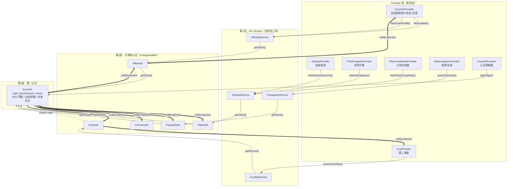
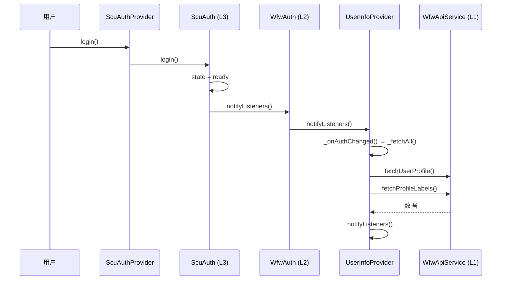
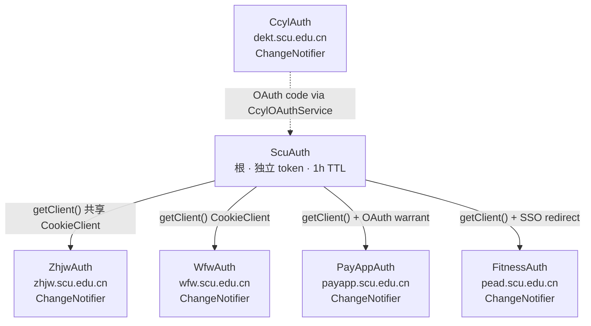
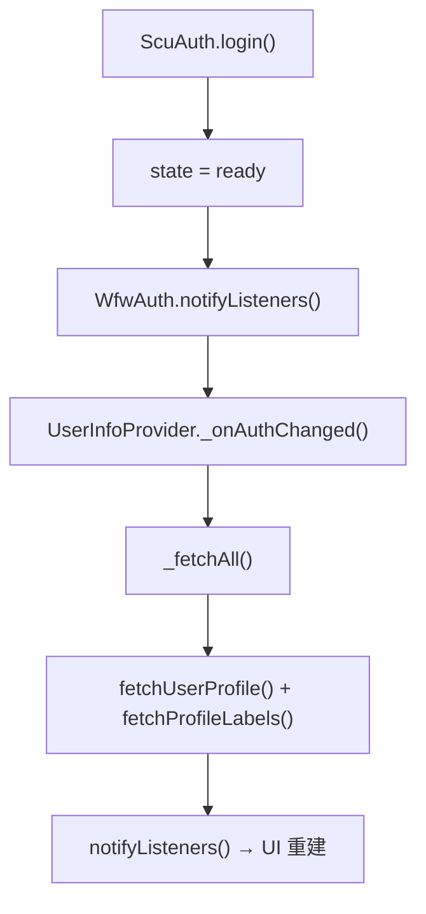
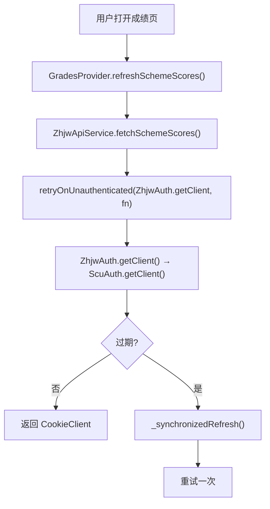
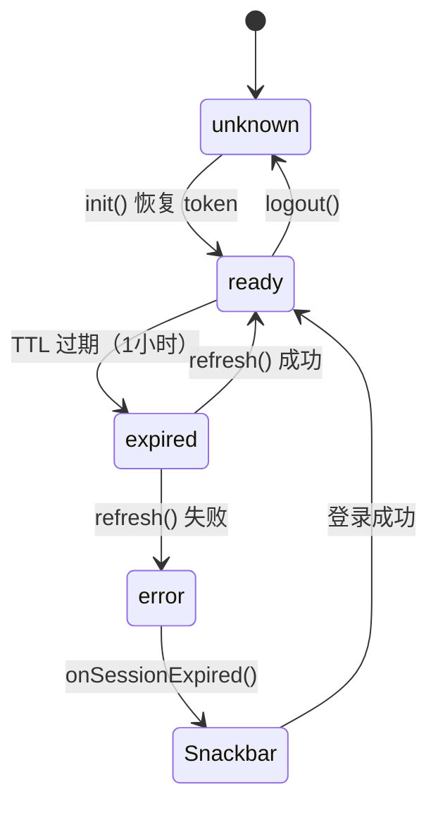
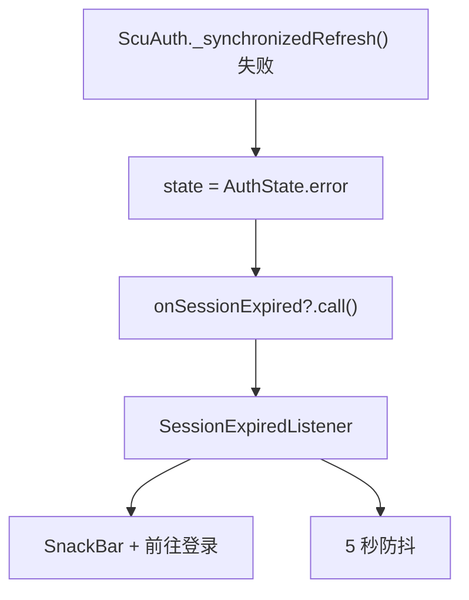
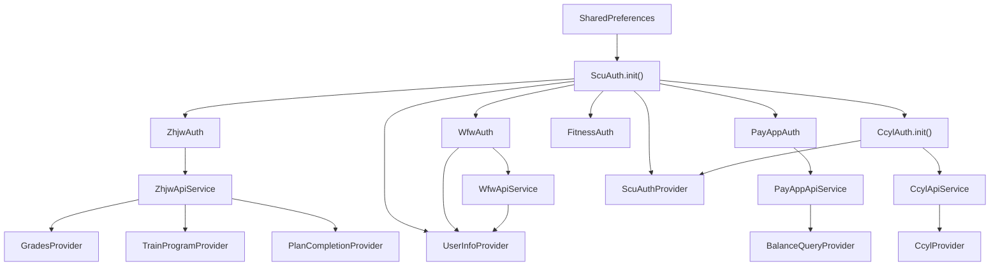

# 认证架构设计决策

## 概述

三层分层架构 + 响应式通知链，统一管理 SCU 统一认证、教务系统、微服务、缴费平台、体测、第二课堂六个后端服务的认证与数据访问。

核心原则：
1. **三层分离**：API Service (L1) → 子系统 Auth (L2) → ScuAuth (L3)
2. **响应式通知链**：L3 状态变化 → L2 监听并转发 → Provider 监听并自动获取数据
3. **异常冒泡**：`UnauthenticatedException` 从 L3 穿透到 Provider
4. **API Service 无状态**：只是 HTTP 工具，不参与通知链
5. **并发安全**：`_synchronizedRefresh` 确保 N 并发 = 1 次刷新

## 三层架构 + 响应式链



### 关键设计：响应式通知链



### 各层职责

| 层 | 职责 | 特点 |
|---|---|---|
| **Provider** | UI 状态管理 + 自动获取数据 | 有状态，监听 L2 Auth，持有 L1 API Service |
| **API Service (L1)** | HTTP 请求 + 解析 + 过期检测 + 重试 | **无状态**，只是工具 |
| **Auth (L2)** | 子系统认证 + 状态转发 | **ChangeNotifier**，监听 ScuAuth 并转发 |
| **ScuAuth (L3)** | 统一认证 + token 管理 + SSO 预热 | 根节点，所有 L2 监听它 |

### 依赖规则

```
✅ Provider 持有 API Service (L1) — 无状态工具
✅ Provider 监听 Auth (L2) — 有状态，感知认证变化
✅ Auth (L2) 监听 ScuAuth (L3) — 转发通知
❌ Provider 直接持有 ScuAuth (L3) — 除 ScuAuthProvider（认证控制器）
❌ API Service 持有 Auth — 方向反了
❌ Auth 持有 API Service — 方向反了
```

## 子系统认证依赖关系



- **ZhjwAuth / WfwAuth**：共享 ScuAuth 的 CookieClient（SSO session）
- **PayAppAuth / FitnessAuth**：继承 `SsoRelayAuth` 基类，做 SSO 跳转
- **CcylAuth**：独立 token，通过 `CcylOAuthService(ScuAuth)` 桥接 SCU

## 异常体系

```dart
sealed class ScuException implements Exception {
  final String message;
}

class UnauthenticatedException extends ScuException  // 认证失败
class ServiceException extends ScuException           // 业务错误
class RateLimitedException extends ServiceException   // 频率限制
class ScuLoginException extends ScuException          // 登录过程错误
```

异常冒泡路径：
```
ScuAuth.getClient() 抛 UnauthenticatedException
  → Auth (L2) 穿透
    → API Service (L1) _request() catch → 重试一次
      → 仍失败 → Provider catch → UI 显示错误
```

## 关键调用链

### 自动获取（响应式）



### 用户触发



## `_synchronizedRefresh` 并发互斥

```dart
Completer<bool>? _refreshCompleter;

Future<bool> _synchronizedRefresh() async {
  if (_refreshCompleter != null) return _refreshCompleter!.future;  // 排队
  _refreshCompleter = Completer<bool>();
  try {
    final result = await _doRefresh();
    _refreshCompleter!.complete(result);
    return result;
  } finally {
    _refreshCompleter = null;
  }
}
```

N 个并发请求同时触发过期 → 只有第 1 个执行 `_doRefresh()`，其余 99 个 `await` 同一个 `Completer.future`。

## 状态机



## 全局错误处理



## 文件结构

```
lib/services/
├── auth/                          # 第2+3层 · 认证
│   ├── auth_state.dart            # AuthState 枚举
│   ├── cookie_client.dart         # 按域隔离 cookie
│   ├── scu_exceptions.dart        # 异常体系
│   ├── scu_auth.dart              # 第3层 · 统一认证（ChangeNotifier）
│   ├── sso_relay_auth.dart        # SSO 中继基类（ChangeNotifier）
│   ├── zhjw_auth.dart             # 第2层 · 教务 SSO（ChangeNotifier）
│   ├── wfw_auth.dart              # 第2层 · 微服务（ChangeNotifier）
│   ├── payapp_auth.dart           # 第2层 · 缴费平台（ChangeNotifier）
│   ├── fitness_auth.dart          # 第2层 · 体测（ChangeNotifier）
│   ├── ccyl_auth.dart             # 第2层 · 第二课堂（ChangeNotifier）
│   └── ccyl_oauth_service.dart    # SCU→CCYL OAuth 桥接
├── api/                           # 第1层 · API Service（无状态）
│   ├── api_request.dart           # retryOnUnauthenticated()
│   ├── zhjw_api_service.dart      # 教务数据 API
│   ├── wfw_api_service.dart       # 微服务数据 API
│   ├── payapp_api_service.dart    # 缴费平台数据 API
│   ├── balance_query_service.dart # 电费纯数据 API
│   └── ccyl_api_service.dart      # 第二课堂数据 API
├── ccyl/
│   └── ccyl_service.dart          # 第二课堂纯数据 API（无状态静态方法）
└── ...

lib/providers/
├── scu_auth_provider.dart         # 认证控制器（直接持有 ScuAuth）
├── user_info_provider.dart        # 监听 WfwAuth，自动获取用户信息
├── grades_provider.dart           # 持有 ZhjwApiService
├── train_program_provider.dart    # 持有 ZhjwApiService
├── plan_completion_provider.dart  # 持有 ZhjwApiService
├── balance_query_provider.dart    # 持有 PayAppApiService
├── ccyl_provider.dart             # 监听 CcylAuth，持有 CcylApiService
├── course_provider.dart           # 纯本地数据
├── app_config_provider.dart       # 纯本地配置
└── app_info_provider.dart         # 版本信息

lib/utils/
└── secure_storage.dart            # FlutterSecureStorage 单例
```

## 依赖注入顺序



## 关键设计决策

### 1. 为什么 L2 Auth 是 ChangeNotifier

ScuAuth (L3) 状态变化时，Provider 需要自动感知。L2 Auth 作为中间层：
- 监听 ScuAuth 的 `notifyListeners`
- 转发给自己的 `notifyListeners`
- Provider 通过 `addListener` 感知变化

这形成了响应式通知链：`ScuAuth → Auth(L2) → Provider`。

### 2. 为什么 API Service 无状态

API Service 只是 HTTP 工具（发请求 + 解析 + 重试），不持有认证状态。这使得：
- 同一个 API Service 可以被多个 Provider 共享
- API Service 不参与通知链，职责清晰
- 测试时只需 mock Auth 层

### 3. 为什么 ScuAuthProvider 直接持有 ScuAuth

ScuAuthProvider 是"认证控制器"，负责：
- login / logout / autoLogin / captcha / credential 管理
- 这些操作需要直接调用 ScuAuth 方法

它不是普通的业务 Provider，而是认证层的 UI 入口。

### 4. 为什么用 `_synchronizedRefresh` 而非简单重试

100 个并发请求同时触发过期，不应执行 100 次 refresh。`Completer` 互斥确保 N 并发 = 1 次刷新。

### 5. 为什么 PayAppAuth/FitnessAuth 继承 SsoRelayAuth

两个类逻辑完全相同：获取 SCU CookieClient → SSO 跳转 → 缓存。唯一差异是 URL。基类消除重复。

### 6. 为什么 CCYL 独立于 SCU

CCYL 有自己的 OAuth token 体系。通过 SCU 的 CAS SSO 获取 OAuth code，然后用 code 换 token。后续请求完全独立。
