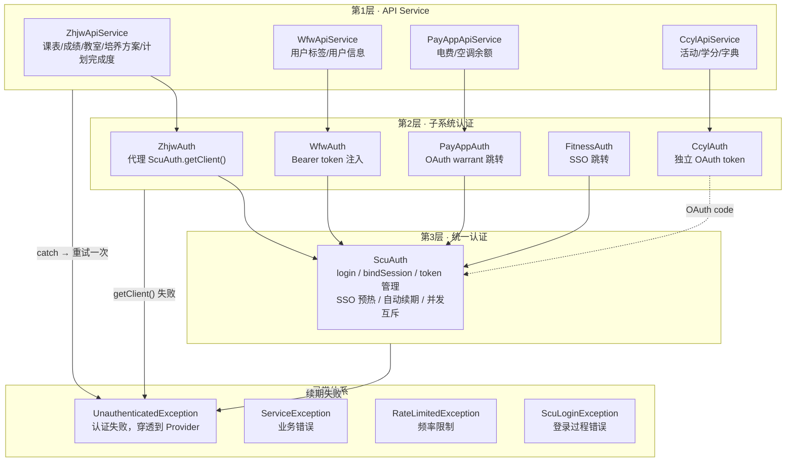
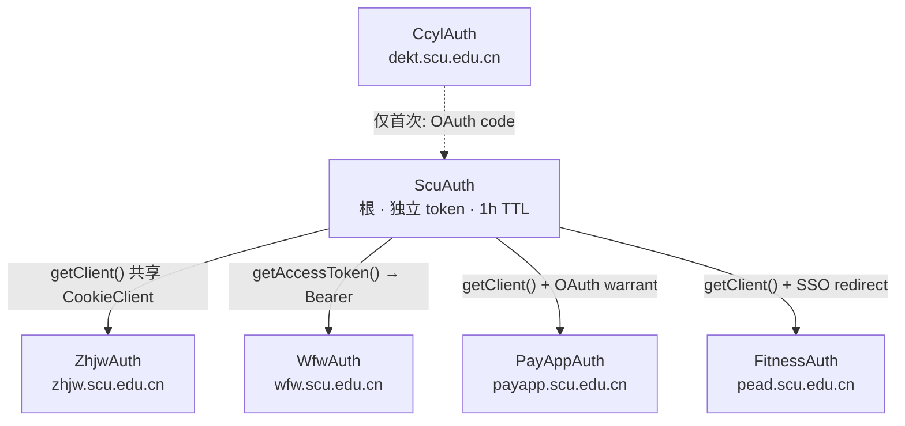
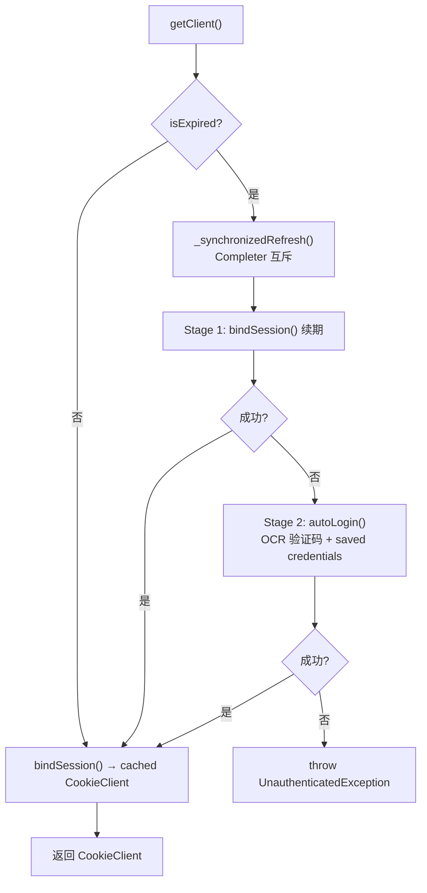
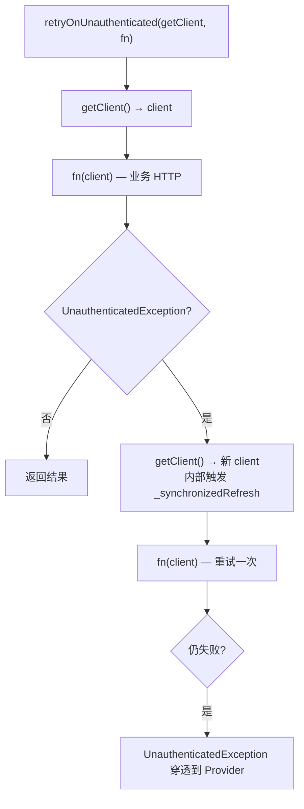
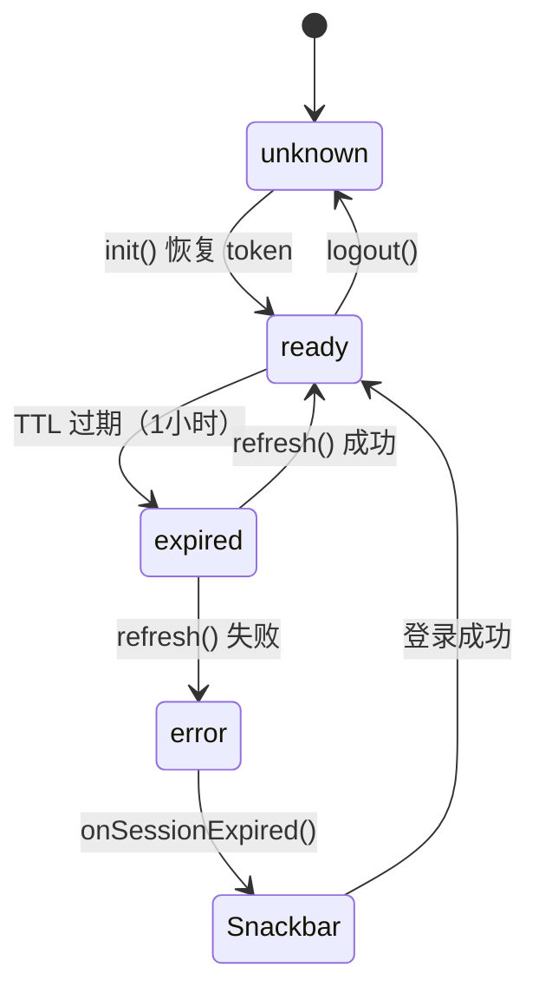
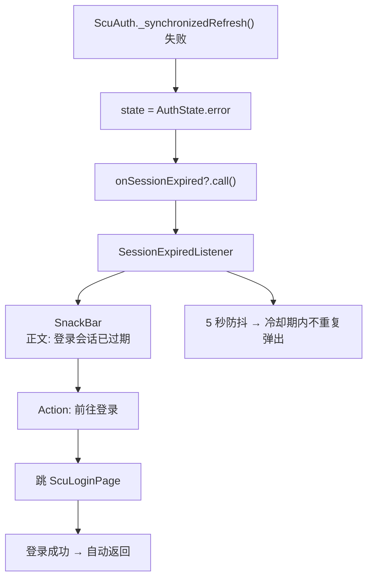
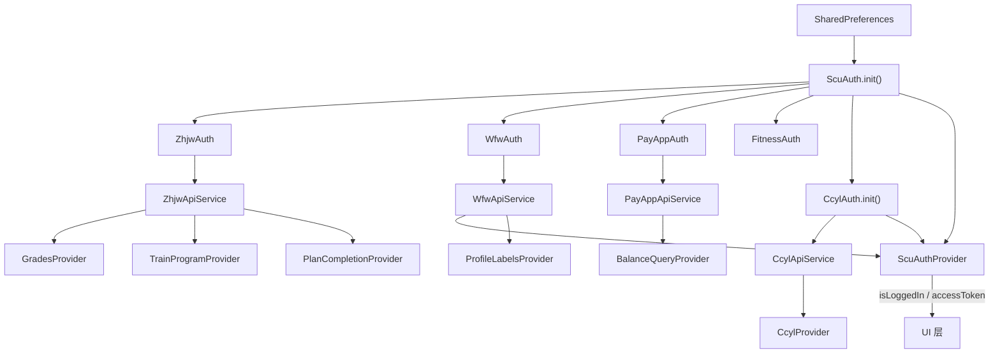

# 认证架构设计决策

## 概述

三层分层架构，统一管理 SCU 统一认证、教务系统、微服务、缴费平台、体测、第二课堂六个后端服务的认证与数据访问。核心目标：

1. 三层清晰分离：API Service → 子系统认证 → 统一认证
2. 每层自动重试，`UnauthenticatedException` 从下往上冒泡
3. Session 过期自动续期（静默续期 / OCR 自动登录）
4. 续期失败时全局提示（Snackbar + 前往登录）
5. 并发请求不会触发多次刷新

## 三层架构



### 各层职责

| 层 | 关心什么 | 不关心什么 |
|---|---|---|
| **第1层 API Service** | HTTP 数据请求 + HTML/JSON 解析、过期信号检测、自动重试一次 | token 管理、SSO 流程、UI 状态 |
| **第2层 子系统认证** | 获取已认证的 Client（SSO 跳转 / Bearer 注入 / OAuth token） | 具体 HTTP 业务请求、UI 状态 |
| **第3层 ScuAuth** | 登录 / token 持久化 / SSO 预热 / 自动续期 / 并发互斥 | 业务数据格式、UI 状态 |
| **Provider** | UI 状态流转（loading → loaded → error）、数据缓存 | HTTP 细节、cookie 管理、token 过期 |
| **SessionExpiredListener** | 全局 Snackbar 展示、防抖、导航到登录页 | 具体哪个子系统过期 |

## 子系统认证依赖关系



- **ZhjwAuth**：教务系统 SSO 预热在 `ScuAuth.bindSession()` 中完成，直接共享 CookieClient
- **WfwAuth**：微服务用 Bearer token，通过 `ScuAuth.getAccessToken()` 获取
- **PayAppAuth / FitnessAuth**：继承 `SsoRelayAuth` 基类，在 SCU CookieClient 上做 SSO 跳转
- **CcylAuth**：独立 token 体系，首次通过 SCU 获取 OAuth code，后续完全独立

## 关键调用链

**业务调用**（Provider）：
```dart
final data = await _zhjwApi.fetchSchemeScores();
```

**展开**：
1. `ZhjwApiService.fetchSchemeScores()` 内部调 `_request(fn)`
2. `_request` = `retryOnUnauthenticated(_auth.getClient, fn)`
3. `ZhjwAuth.getClient()` → `ScuAuth.getClient()`

**`ScuAuth.getClient()` 内部**：



**`retryOnUnauthenticated` 重试**：



## 状态机



## 全局错误处理



## 异常体系

```dart
sealed class ScuException implements Exception {
  final String message;
}

class UnauthenticatedException extends ScuException  // 认证失败
class ServiceException extends ScuException           // 业务错误
class RateLimitedException extends ServiceException   // 频率限制
class ScuLoginException extends ScuException          // 登录过程错误
```

异常冒泡路径：
```
ScuAuth.getClient() 抛 UnauthenticatedException
  → ZhjwAuth.getClient() 穿透
    → ZhjwApiService._request() catch → 重试一次
      → 仍失败 → Provider catch → UI 显示错误
```

## 关键设计决策

### 1. 为什么分三层而非两层

**两层方案**：Provider → Service（Service 同时管认证和数据）

**问题**：
- Service 类职责过重（ScuApiService 572 行）
- 认证逻辑（SSO 跳转、token 管理）和业务逻辑（HTML 解析）混在一起
- 不同子系统的认证方式不同（Cookie vs Bearer vs OAuth token），难以统一

**三层方案**：
- 第3层只管 SCU 统一认证（token、SSO 预热）
- 第2层只管子系统认证（SSO 跳转、Bearer 注入）
- 第1层只管数据请求（HTTP、解析）

### 2. 为什么用 `retryOnUnauthenticated` 而非 `AuthSession.request()`

旧方案用 `AuthSession<T>` 泛型基类 + `request(fn)` 模板方法。问题是：
- 泛型 `T extends http.Client` 对不同 Client 类型（CookieClient / http.Client）不友好
- `request()` 内置了重试逻辑，但重试应该是 API Service 的职责

新方案用顶层函数 `retryOnUnauthenticated<C>(getClient, fn)`：
- 泛型参数 `C` 是 Client 类型，由调用方推断
- 重试逻辑显式且可组合
- 3 个 API Service 共用同一个函数，消除重复

### 3. 为什么 ScuAuth 内置 `_synchronizedRefresh`

100 个并发请求同时触发过期，不应该执行 100 次 `refresh()`。

```dart
Completer<bool>? _refreshCompleter;

Future<bool> _synchronizedRefresh() async {
  if (_refreshCompleter != null) return _refreshCompleter!.future;  // 排队等结果
  _refreshCompleter = Completer<bool>();
  try {
    final result = await _doRefresh();
    _refreshCompleter!.complete(result);
    return result;
  } finally {
    _refreshCompleter = null;
  }
}
```

第 1 个请求创建 `Completer` 并执行刷新。其余 99 个 `await` 同一个 `Completer.future`，共享结果。

### 4. 为什么 PayAppAuth/FitnessAuth 继承 `SsoRelayAuth`

两个类的逻辑完全相同：获取 SCU CookieClient → 做 SSO 跳转 → 缓存结果。唯一差异是跳转 URL。

```dart
abstract class SsoRelayAuth {
  final ScuAuth _scuAuth;
  final String _ssoUrl;
  Future<CookieClient> getClient() async { /* 共享逻辑 */ }
}

class PayAppAuth extends SsoRelayAuth {
  PayAppAuth(ScuAuth s) : super(s, 'https://payapp.scu.edu.cn/eleFees/oauth/airWarrant');
}
```

新增第3个子系统只需 3 行代码。

### 5. 为什么 `_checkSessionExpiry()` 放在 API Service 层

教务系统不会返回标准的 401。Session 过期的信号是：
- HTTP 302 重定向到登录页
- 响应 body 为空
- 响应 body 是 HTML 登录页面（`<` 开头且包含 `login`）

这些启发式检测是教务系统的特定行为，放在第1层 API Service 最合理。检测到过期后抛 `UnauthenticatedException`，`retryOnUnauthenticated` 自动接管。

### 6. 为什么 CCYL 独立于 SCU

第二课堂有自己的 OAuth token 体系，通过 SCU 的 CAS SSO 获取 OAuth code，然后用 code 换 token。一旦 token 获取成功，后续请求完全独立于 SCU。

所以 `CcylAuth` 有独立的 token 存储（`FlutterSecureStorage`）和独立的 `reLogin()`（重新跑 OAuth 流程）。

### 7. 为什么用 Snackbar 而非 Dialog

旧方案用 `SessionExpiryHandler` 弹 `AlertDialog`（阻塞式）。新方案用 `SnackBar`：
- 不打断用户当前操作
- 5 秒自动消失
- 带"前往登录"action 按钮
- 全局单例（`SessionExpiredListener`），5 秒防抖

## 文件结构

```
lib/services/
├── auth/                          # 第2+3层 · 认证
│   ├── auth_state.dart            # AuthState 枚举
│   ├── cookie_client.dart         # 按域隔离 cookie
│   ├── scu_exceptions.dart        # 异常体系
│   ├── scu_auth.dart              # 第3层 · 统一认证
│   ├── sso_relay_auth.dart        # SSO 中继基类
│   ├── zhjw_auth.dart             # 第2层 · 教务 SSO
│   ├── wfw_auth.dart              # 第2层 · 微服务 Bearer
│   ├── payapp_auth.dart           # 第2层 · 缴费平台
│   ├── fitness_auth.dart          # 第2层 · 体测
│   ├── ccyl_auth.dart             # 第2层 · 第二课堂
│   └── ccyl_oauth_service.dart    # SCU→CCYL OAuth 桥接
├── api/                           # 第1层 · API Service
│   ├── api_request.dart           # retryOnUnauthenticated()
│   ├── zhjw_api_service.dart      # 教务数据 API
│   ├── wfw_api_service.dart       # 微服务数据 API
│   ├── payapp_api_service.dart    # 缴费平台数据 API
│   ├── balance_query_service.dart # 电费纯数据 API
│   └── ccyl_api_service.dart      # 第二课堂数据 API
├── ccyl/
│   └── ccyl_service.dart          # 第二课堂纯数据 API（无状态静态方法）
└── ...
```

## 依赖注入顺序


